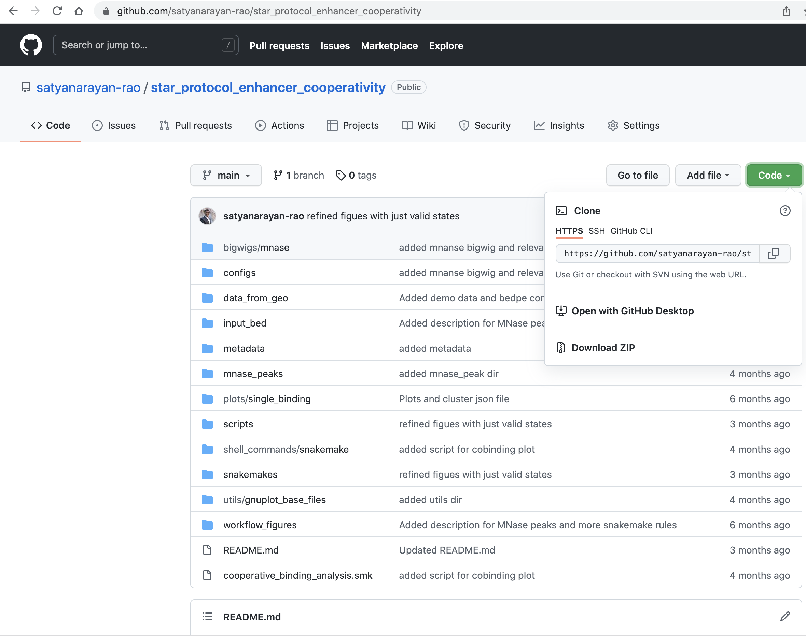

# STAR protocol for cooperative binding analysis using dSMF data

This protocol is derived from [Rao et al., 2021](https://pubmed.ncbi.nlm.nih.gov/33705711/).  

## Before you begin

### Download the pipeline

**Method 1:**

If `git` command is available on the machine you want to run the pipeline, it can simply be downlaod using the following command:
```
git clone https://github.com/satyanarayan-rao/star_protocol_enhancer_cooperativity.git
```

**Method 2** 

Please visit the github repository [here](https://github.com/satyanarayan-rao/star_protocol_enhancer_cooperativity). Please click on the code and choose "Download Zip" option as shown in the image below.

 

### Install reuqired softwares

This pipeline is Linux/Unix-based system compatible. 

Please install Anaconda [Individual Edition](https://www.anaconda.com/products/individual) first. 

Please follow the steps below to build right environment to run the pipeline. 

- Create an environment `dsmf_viz` using the command: `conda create -n dsmf_viz python=3.6`
- Activate this this environment using command `source activate dsmf_viz` 
- Run `install_required_packages.sh` to install required packages mentioned below:
    - Bowtie2
    - Bismark
    - Trim Galore
    - Snakemake
    - Bedtools
    - Samtools
    - pyBigWig
    - Pandas
    - Numpy


Data for demo is included in this github repository, but to visualize at your
sites of interest, please download the sequencing data, and keep them in
`data_from_geo/`. Here is the list of URLs for the sequencing data. 
```
ftp://ftp.sra.ebi.ac.uk/vol1/fastq/SRR313/006/SRR3133326/SRR3133326_1.fastq.gz
ftp://ftp.sra.ebi.ac.uk/vol1/fastq/SRR313/006/SRR3133326/SRR3133326_2.fastq.gz
ftp://ftp.sra.ebi.ac.uk/vol1/fastq/SRR313/007/SRR3133327/SRR3133327_1.fastq.gz
ftp://ftp.sra.ebi.ac.uk/vol1/fastq/SRR313/007/SRR3133327/SRR3133327_2.fastq.gz
ftp://ftp.sra.ebi.ac.uk/vol1/fastq/SRR313/008/SRR3133328/SRR3133328_1.fastq.gz
ftp://ftp.sra.ebi.ac.uk/vol1/fastq/SRR313/008/SRR3133328/SRR3133328_2.fastq.gz
ftp://ftp.sra.ebi.ac.uk/vol1/fastq/SRR313/009/SRR3133329/SRR3133329_1.fastq.gz
ftp://ftp.sra.ebi.ac.uk/vol1/fastq/SRR313/009/SRR3133329/SRR3133329_2.fastq.gz
```

### Download reference genome

Please run the following command to download `dm3` reference genome. 
```
$ sh downlaod_reference_genome.sh 
```

## Run the pipeline


### To reproduce panels of Figure1 in the STAR protocol manuscript

Please run the following single command. 

```
snakemake --snakefile cooperative_binding_analysis.smk plots/single_binding/suppressed_merged_demo_S2_to_example_spanning_lf_15_rf_15_extended_left_150_right_150_roi_peak_229.fp.pdf plots/single_binding/suppressed_merged_demo_S2_to_example_spanning_lf_15_rf_15_extended_left_150_right_150_roi_peak_229.methylation.pdf --configfile configs/config.yaml
```


### To reproduce panels of Figure2 in the STAR protocol manuscript
```
snakemake  --snakefile cooperative_binding_analysis.smk plots/cobinding_bedpe/suppressed_merged_demo_S2_to_example_cobinding_lf_15_rf_15_extended_left_300_right_300_roi_peak_110_4_and_peak_110_6.fp.pdf plots/cobinding_bedpe/suppressed_merged_demo_S2_to_example_cobinding_lf_15_rf_15_extended_left_300_right_300_roi_peak_110_4_and_peak_110_6.methylation.pdf --configfile configs/config.yaml
```
